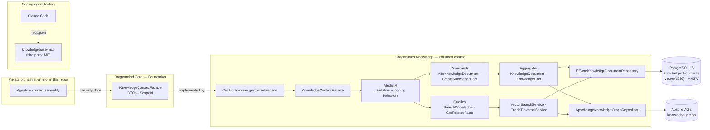

# Dragonmind Knowledge

Dragonmind is a multi-agent platform. Its orchestration — the agents, model routing, and prompts — lives in a private repository and is **not** here. This repository is the layer underneath it: the Knowledge bounded context that gives those agents scoped memory. It combines semantic retrieval over **pgvector**, a fact graph in **Apache AGE**, and an **anti-corruption-layer facade**, so no agent or orchestration code ever touches the storage schema. It is extracted as a standalone .NET 10 solution with its tests, CI, and the Claude Code instructions, skills, and subagents used to build it.

## Architecture



Consumers see `IKnowledgeContextFacade` and the DTOs it returns — never an aggregate, a repository, `KnowledgeDbContext`, a pgvector type, or Cypher. Every read that can cross scopes takes a `ScopeId`.

## Run it

One command: build, migrate, and run every unit and integration test against a real Postgres with pgvector and Apache AGE:

```bash
docker compose --profile test up --build --exit-code-from tests
```

Day to day:

```bash
docker compose up -d --wait db
export KNOWLEDGE_TEST_CONNECTION="Host=localhost;Port=5455;Database=knowledge;Username=knowledge"
dotnet test
```

The unit tests need nothing but the SDK. The integration tests read that one variable and fail loudly
when it is missing rather than skipping — a suite that quietly no-ops when the database is unreachable
reports green while proving nothing.

The database container binds to `127.0.0.1:5455` with trust auth, so the repository contains no credentials.

## How the agents here are wired

`.claude/` is the tooling this code was built with, not decoration: `CLAUDE.md` as project memory,
skills carrying the conventions for each technology in the stack, and subagents scoped to one job
each — a data engineer that owns the migration and the Cypher, a test engineer, a reviewer, a
security engineer that audits the scope boundary.

`.mcp.json` wires them to a knowledge-base MCP server
([mbcrawfo/KnowledgeBaseServer](https://github.com/mbcrawfo/KnowledgeBaseServer), MIT — a separate
project, pinned by digest), which they search before working and write to when something turns out
to be non-obvious. Start it with `docker compose --profile agents up -d`.

Two things in this repository came out of that loop and are worth reading as evidence of it, because
both are the kind of finding that only shows up once you go looking:

- The `MATERIALIZED` CTE in `EfCoreKnowledgeDocumentRepository` carries the measurements that forced
  it, including the fix that *did not* work (`hnsw.iterative_scan = strict_order`, still 12 of 30
  under-fetching).
- `ApacheAgeKnowledgeGraphRepository` scopes every edge of a variable-length path rather than the
  anchor node, with the AGE-specific reason recorded next to it — including the list-predicate form
  that this AGE build rejects outright.

## Design notes

### Why DDD and CQRS for an agent platform

Agents write memory as fire-and-forget extraction after a turn, and read it synchronously while assembling the next prompt. Those two paths change for different reasons and fail in different ways. Separating commands from queries lets each evolve and be tested alone: every handler is covered with Moq and no database. MediatR pipeline behaviors validate and log every request uniformly. The bounded context keeps the storage model — EF entities, vector columns, graph queries — free to change without touching a single caller.

### How the anti-corruption layer keeps one agent run's memory out of another's

**Schema bleeding.** Before the facade existed, orchestration code reached storage through a shared repository. It generated the embedding itself, built a `Pgvector.Vector`, and passed storage objects straight through, so every change to the vector schema rippled into agent code. The facade replaced that with `SearchKnowledgeAsync(query, scopeId, maxResults)` returning DTOs; embedding generation, vector types, and Cypher all moved behind it. *(Simplified from the private history.)* `AclBoundaryTests` now fail the build if a domain or persistence type ever appears in the facade contract.

**Cross-scope contamination.** Retrieval originally ranked purely by cosine distance, with no scope predicate. Probing a shared development database with one run's own document, 4 of its 5 nearest neighbours came from other runs. The fix is layered:
- The scope is a required facade parameter, so omitting it is a compile error.
- Scoped similarity search gathers that scope's rows in a `MATERIALIZED` CTE before ranking. With an HNSW index the planner turned the scope filter into a post-filter: 12 of 30 probes returned fewer than the requested five rows at 5,000 rows per scope, and 0 of 30 after the change.
- Graph traversal constrains every edge of a path to the scope, so a fact cannot arrive through another run's edge.

Two-scope integration tests pin both stores.

### Keeping token spend down

Structured model output uses a compact, header-counted tabular notation instead of YAML, and every agent call carries only the response schema for its own request type rather than a shared schema for all of them. That code lives in the private repository.

The notation is measured rather than taken on trust: its advertised savings are quoted against JSON, and what it replaced here was YAML, which is already compact. Rendering the same prompt builders and serialising the same payloads either side of the migration commit — over 963 real turns and 602 real graph edges from a development database, counted with the o200k vocabulary and cross-checked against the provider's own `countTokens` endpoint:

| Emitted payload | 3 rows | 10 rows | 25 rows |
|---|---|---|---|
| Graph updates (uniform three-field rows) | −27.5% | −39.5% | −43.4% |
| State diffs | −37.5% | −45.8% | — |
| Lore facts (prose-dominated rows) | −3.2% | −7.5% | −11.3% |

The saving is in what the model **emits**, and it comes from amortising one header across many uniform rows: a single row saves almost nothing, and the curve plateaus around 41–46%. Rows whose bulk is prose barely move, because no encoding compresses a sentence.

The prompt *instructions* went the other way. The tabular format's rules block is longer than the YAML one it replaced, costing roughly 5% more input tokens per turn across the seven per-turn builders. That is a good trade here only because emitted rows outnumber the fixed instruction block; on an agent that returned one row per call it would not be.

The two tokenizers agreed closely throughout — −38.2% against −39.5% on the same ten-row payload.

This layer stays model-agnostic: it needs only an `IEmbeddingGenerator`, and it enforces the vector width (1536) whatever the provider returns.

## License

MIT — see [LICENSE](LICENSE). The knowledge-base MCP server wired in `.mcp.json` is a separate third-party project under its own MIT license.
